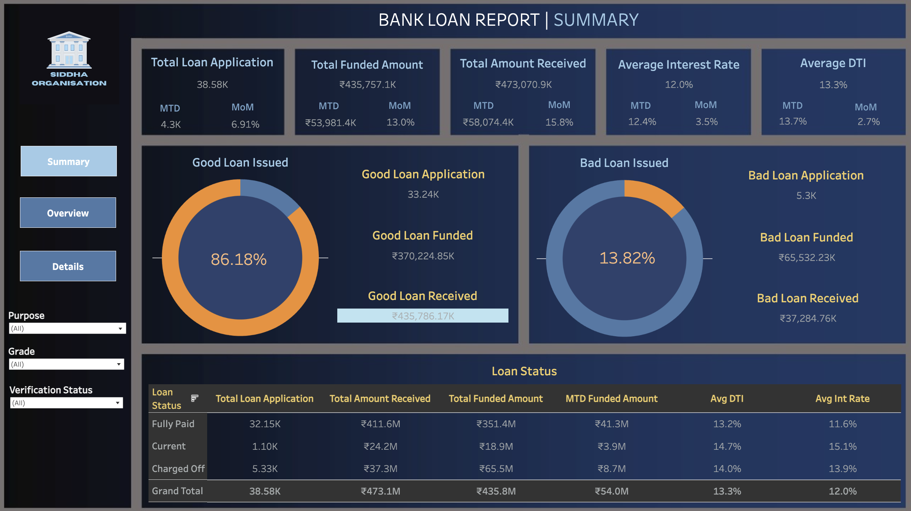

# Bank Loan Analysis Dashboard

This project provides an in-depth analysis of a bank’s loan system, visualized using Tableau and powered by MySQL as the database source. The dashboard is designed to offer quick insights into the overall performance of loan applications and their funding status.

Project Overview

This Tableau dashboard is divided into three key sections:

	1.	Summary:
	•	Overview of total loan applications, funded amounts, amounts received, average interest rate, and average debt-to-income (DTI) ratio.
	•	Visual breakdown of Good Loans vs Bad Loans.
	•	Month-to-Date (MTD) and Month-over-Month (MoM) trends.
	2.	Overview:
	•	Analysis of loan distribution by various factors such as loan purpose, grade, and verification status.
	•	Dynamic filters enable quick exploration of specific loan categories.
	3.	Details:
	•	Detailed insights into individual loan statuses, including:
	•	Fully Paid
	•	Current
	•	Charged Off
	•	Further analysis of funding amounts and loan health.

Features

	•	Interactive filtering options for deep-dive analysis.
	•	Visual representation of key performance indicators (KPIs).
	•	Comprehensive breakdown of loan performance with Good vs Bad loan analysis.

Technologies Used

	•	Tableau: For data visualization and dashboard creation.
	•	MySQL: For storing and querying loan system data.
	•	Tableau Connector: For connecting the MySQL database to Tableau.
